# 🐧 MLOps Penguins — Taller MLflow + PostgreSQL + MinIO

Implementación completa de un pipeline de MLOps para clasificación de
especies de pingüinos (Palmer Penguins Dataset), siguiendo la arquitectura
basada en servicios independientes comunicados por red.

---

## Arquitectura

```
                           Internet / Docker Network
  ┌──────────────┐    ┌──────────────────┐    ┌──────────────┐    ┌──────────────┐
  │  JupyterLab  │◄──►│     MLflow       │◄──►│    MinIO     │    │   FastAPI    │
  │  :8888       │    │  :5001           │    │  :9000/:9001 │    │   :8000      │
  └──────────────┘    └──────────────────┘    └──────────────┘    └──────────────┘
         │                    │                       │                   │
         └────────────────────┴───────────────────────┴───────────────────┘
                                        │
                              ┌─────────▼────────┐
                              │    PostgreSQL     │
                              │    :5432          │
                              │  ┌─────────────┐ │
                              │  │penguins_raw │ │
                              │  │penguins_proc│ │
                              │  │predict_log  │ │
                              │  └─────────────┘ │
                              └──────────────────┘

  MLflow internamente:
  ┌──────────────────────────────────────────┐
  │         systemd_service equivalent       │
  │  ┌──────────────┐    ┌────────────────┐  │
  │  │Model Registry│◄──►│Server Tracking │  │
  │  └──────────────┘    └────────────────┘  │
  │         │                    │            │
  │    PostgreSQL             MinIO S3        │
  │    (metadata)           (artifacts)       │
  └──────────────────────────────────────────┘
```

---

## Servicios

| Servicio    | Puerto | Descripción |
|-------------|--------|-------------|
| PostgreSQL  | 5432   | BD para metadata MLflow + datos raw + datos procesados |
| MinIO       | 9000   | API S3 — almacenamiento de artefactos |
| MinIO UI    | 9001   | Consola web de administración |
| MLflow      | 5001   | Tracking server + Model Registry |
| JupyterLab  | 8888   | Entorno de experimentación |
| FastAPI     | 8000   | API de inferencia |

---

## Estructura del proyecto

```
mlops-penguins/
├── docker-compose.yml          # Orquestación de todos los servicios
├── db-init/
│   └── 01_init.sql             # Esquema PostgreSQL (tablas raw, processed, log)
├── jupyter/
│   ├── Dockerfile              # Imagen JupyterLab
│   ├── requirements.txt
│   ├── data/
│   │   └── penguins.csv        # Dataset Palmer Penguins
│   └── notebooks/
│       └── penguins_mlflow.ipynb   # Notebook principal (20+ runs)
└── api/
    ├── Dockerfile              # Imagen FastAPI
    ├── requirements.txt
    └── main.py                 # Servicio de inferencia
```

---

## Requisitos

- Docker ≥ 24
- Docker Compose ≥ 2.20
- 4 GB RAM disponibles (recomendado 8 GB)

---

## Inicio rápido

### 1. Levantar todos los servicios

```bash
docker compose up -d
```

### 2. Verificar el estado

```bash
docker compose ps
docker compose logs -f mlflow      # ver progreso de instalación
```

> ⚠️ MLflow tarda ~2–3 minutos en instalar dependencias la primera vez.

### 3. Abrir JupyterLab

```
http://localhost:8888
```

Abrir y ejecutar el notebook:
```
notebooks/penguins_mlflow.ipynb
```

#### Inicio


#### Distribucion de caracteristicas por especie


#### Guardar datos en PostgreSQL
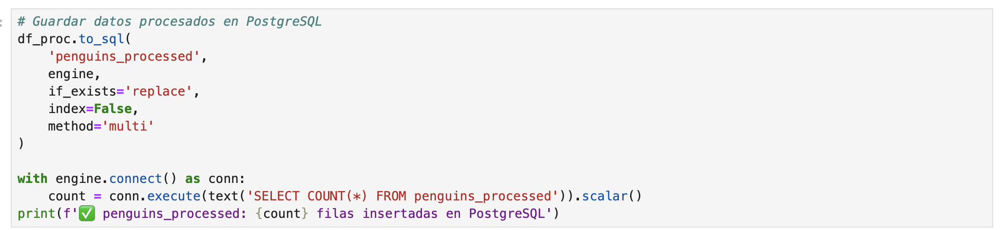

#### Experimentacion Random Forest
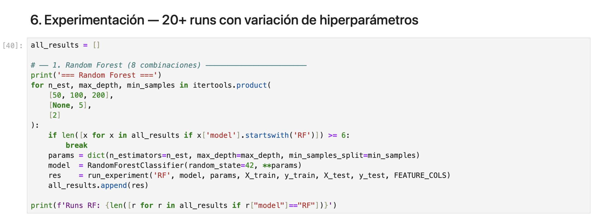

#### Experimentacion Gradient Boosting
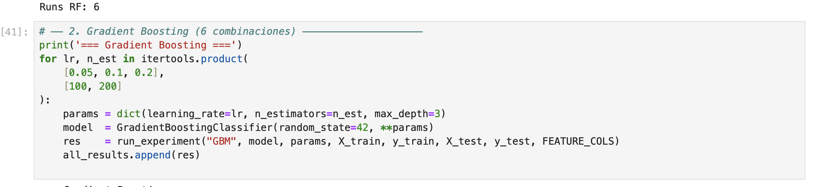

#### Experimentacion Logistic Regression
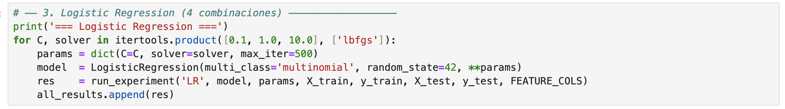

#### Experimentacion SVM
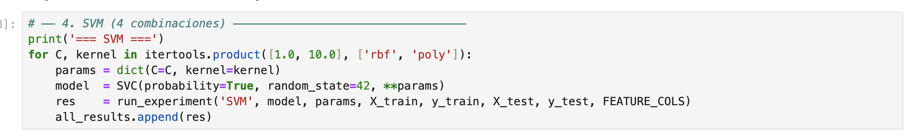

#### Experimentacion KNN


#### Resultados
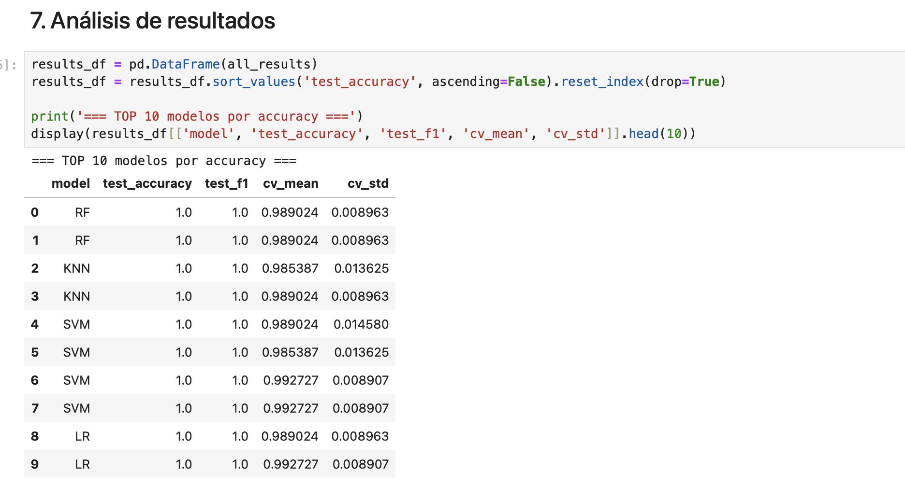

#### Comparacion


#### Resumen


### 4. Ver experimentos en MLflow

```
http://localhost:5001
```

#### Runs
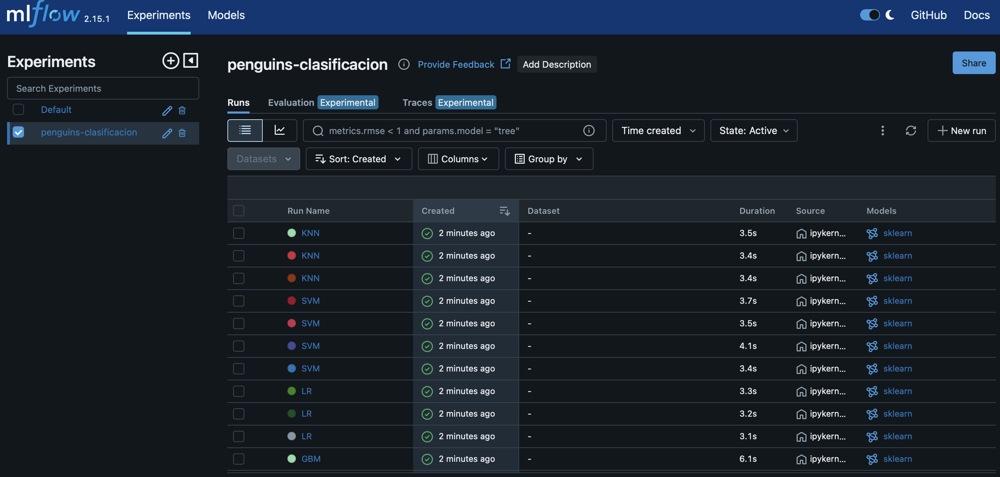

#### Metrics
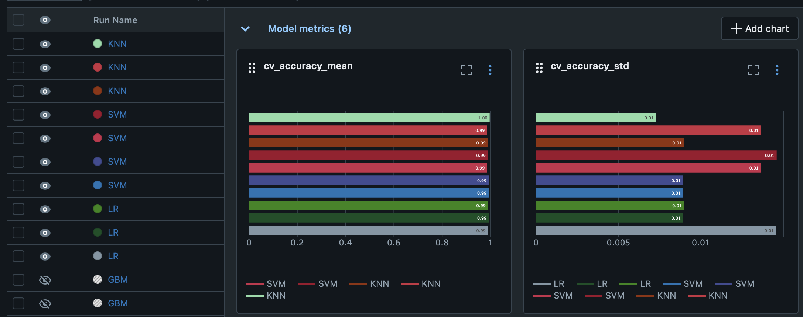


#### Model


### 5. Ver artefactos en MinIO

```
http://localhost:9001
usuario   : minioadmin
contraseña: minioadmin123
```

### 6. Usar la API de inferencia

```
http://localhost:8000/docs
```

#### Artefactos

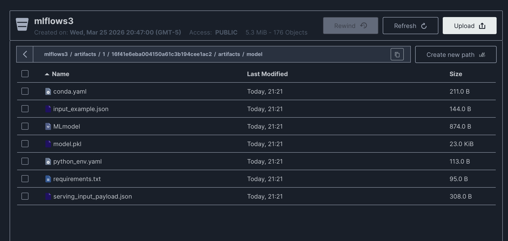

---

## Uso de la API


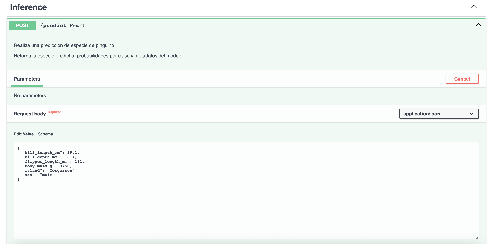
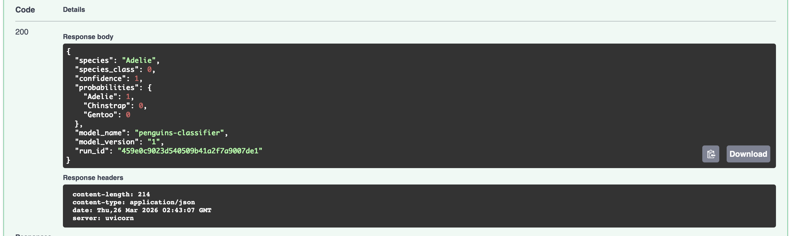
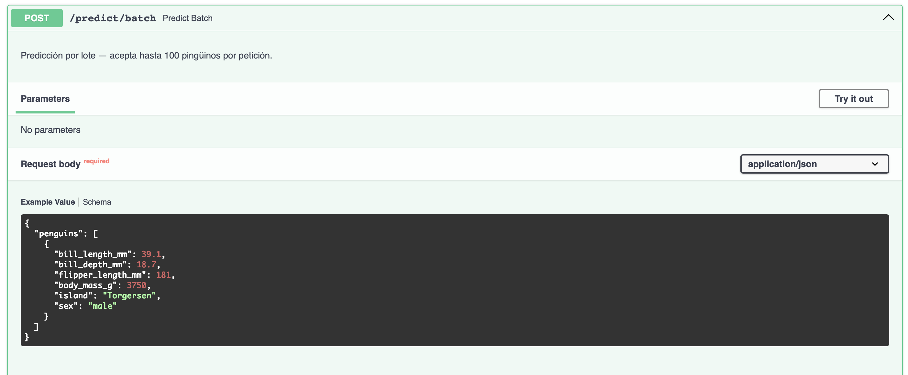


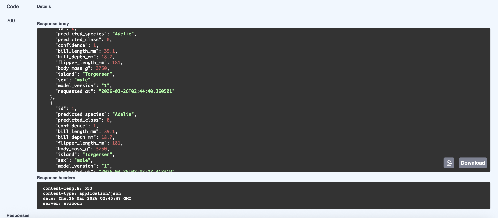

### Recargar modelo (sin reiniciar)

```bash
curl -X POST http://localhost:8000/model/reload
```

### Predicción individual

```bash
curl -X POST http://localhost:8000/predict \
  -H "Content-Type: application/json" \
  -d '{
    "bill_length_mm": 39.1,
    "bill_depth_mm": 18.7,
    "flipper_length_mm": 181.0,
    "body_mass_g": 3750.0,
    "island": "Torgersen",
    "sex": "male"
  }'
```

**Respuesta:**
```json
{
  "species": "Adelie",
  "species_class": 0,
  "confidence": 0.9823,
  "probabilities": {
    "Adelie": 0.9823,
    "Chinstrap": 0.0098,
    "Gentoo": 0.0079
  },
  "model_name": "penguins-classifier",
  "model_version": "1",
  "run_id": "abc123..."
}
```

### Predicción en lote

```bash
curl -X POST http://localhost:8000/predict/batch \
  -H "Content-Type: application/json" \
  -d '{
    "penguins": [
      {"bill_length_mm": 39.1, "bill_depth_mm": 18.7, "flipper_length_mm": 181.0, "body_mass_g": 3750.0, "island": "Torgersen", "sex": "male"},
      {"bill_length_mm": 46.5, "bill_depth_mm": 17.9, "flipper_length_mm": 192.0, "body_mass_g": 3500.0, "island": "Dream", "sex": "female"}
    ]
  }'
```

### Información del modelo

```bash
curl http://localhost:8000/model/info
```

### Historial de predicciones

```bash
curl "http://localhost:8000/predictions?limit=10"
```

---

## Base de datos PostgreSQL

Conexión directa (opcional):

```bash
docker exec -it mlops-postgres psql -U mlops -d mlops_db
```

Consultas útiles:

```sql
-- Datos crudos
SELECT species, COUNT(*) FROM penguins_raw GROUP BY species;

-- Datos procesados por split
SELECT split, COUNT(*) FROM penguins_processed GROUP BY split;

-- Historial de predicciones
SELECT predicted_species, COUNT(*), AVG(confidence)
FROM predictions_log
GROUP BY predicted_species;
```

---

## Flujo del notebook (20+ experimentos)

1. **Carga raw** → CSV `penguins.csv` → tabla `penguins_raw` en PostgreSQL
2. **Preprocesamiento** → limpieza, one-hot encoding, label encoding → tabla `penguins_processed`
3. **Experimentación** con 5 algoritmos y variaciones de hiperparámetros:

| Algoritmo | Parámetros variados | Runs |
|-----------|--------------------|----|
| Random Forest | n_estimators, max_depth | 6 |
| Gradient Boosting | learning_rate, n_estimators | 6 |
| Logistic Regression | C, solver | 3 |
| SVM | C, kernel | 4 |
| KNN | n_neighbors, weights | 3 |
| **Total** | | **22 runs** |

4. **Selección** del mejor modelo por `test_accuracy`
5. **Registro** en MLflow Model Registry → stage `Production`
6. **Validación** cargando el modelo desde el Registry

---

## Parar el ambiente

```bash
# Parar sin borrar datos
docker compose down

# Parar y borrar volúmenes (reset total)
docker compose down -v
```

---

## Variables de entorno

| Variable | Valor por defecto | Descripción |
|----------|------------------|-------------|
| `POSTGRES_USER` | mlops | Usuario PostgreSQL |
| `POSTGRES_PASSWORD` | mlops_secret | Contraseña PostgreSQL |
| `POSTGRES_DB` | mlops_db | Base de datos |
| `MINIO_ROOT_USER` | minioadmin | Usuario MinIO |
| `MINIO_ROOT_PASSWORD` | minioadmin123 | Contraseña MinIO |
| `MLFLOW_S3_ENDPOINT_URL` | http://minio:9000 | Endpoint MinIO como S3 |

---

## Clases predichas

| Código | Especie | Descripción |
|--------|---------|-------------|
| 0 | Adelie | La más común (152 muestras) |
| 1 | Chinstrap | Menos frecuente (68 muestras) |
| 2 | Gentoo | Tamaño mayor (124 muestras) |